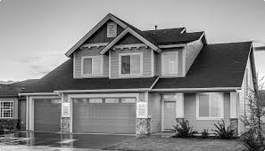

# Parallel Image Processing — Threads

Image processing using Python threads (`concurrent.futures.ThreadPoolExecutor`).
Each thread handles a horizontal strip of the image. Strips for `blur` and `canny` include a halo (extra rows) to avoid border artifacts.

## Requirements

```bash
pip install opencv-python numpy
```

## Usage

```bash
python3 main.py <input> <output> <operation> [options]
```

### Arguments

| Argument | Description |
|---|---|
| `input` | Path to the input image |
| `output` | Path to save the result |
| `operation` | One of: `grayscale`, `blur`, `canny`, `invert`, `threshold` |
| `--threads N` | Number of threads (default: `4`) |
| `--kernel N` | Kernel size for blur (default: `5`, must be odd) |
| `--threshold N` | Threshold value for threshold operation (default: `127`) |
| `--low N` | Low threshold for Canny edge detection (default: `100`) |
| `--high N` | High threshold for Canny edge detection (default: `200`) |

## Examples

```bash
# Grayscale
python3 main.py images/input.jpeg images/grayscale.jpeg grayscale --threads 4

# Gaussian blur with kernel size 7
python3 main.py images/input.jpeg images/blur.jpeg blur --threads 4 --kernel 7

# Canny edge detection
python3 main.py images/input.jpeg images/canny.jpeg canny --threads 4 --low 100 --high 200

# Invert colors
python3 main.py images/input.jpeg images/invert.jpeg invert --threads 4

# Binary threshold
python3 main.py images/input.jpeg images/threshold.jpeg threshold --threads 4 --threshold 127
```

## Output images

| Operation | Result |
|---|---|
| Original |  |
| Grayscale |  |
| Blur |  |
| Canny |  |
| Invert |  |
| Threshold |  |
